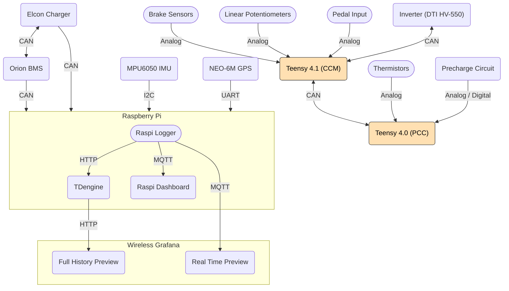

# Architecture



# Development Environment

## fsae-daq
### Accessing fsae-daq from base station
Run Grafana:
```bash
docker run -d -p 3000:3000 --name=grafana grafana/grafana-enterprise
```
### Setting up development environment
- Open the project in VSCode
- Install the [Dev Containers](https://marketplace.visualstudio.com/items?itemName=ms-vscode-remote.remote-containers) extension for VSCode
- Open the command palette (Super+Shift+P) and run `Dev Containers: Rebuild and Reopen in Container`
- The project will now be running in a container with all the necessary dependencies (rust) and services (grafana, influxdb)
- Now run `cargo run --bin fsae-daq` to start the logging service
- You can view the dashboard at `http://localhost:3000` (default username: admin, password: admin)
- You can view the influxdb database (`http://localhost:8086`) or MQTT broker (`localhost:1883`), by adding it as a data source in Grafana
